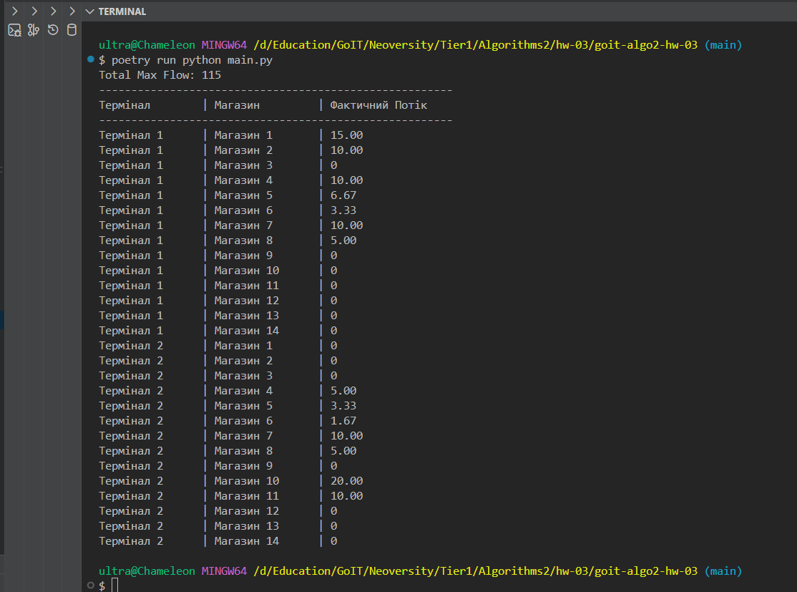
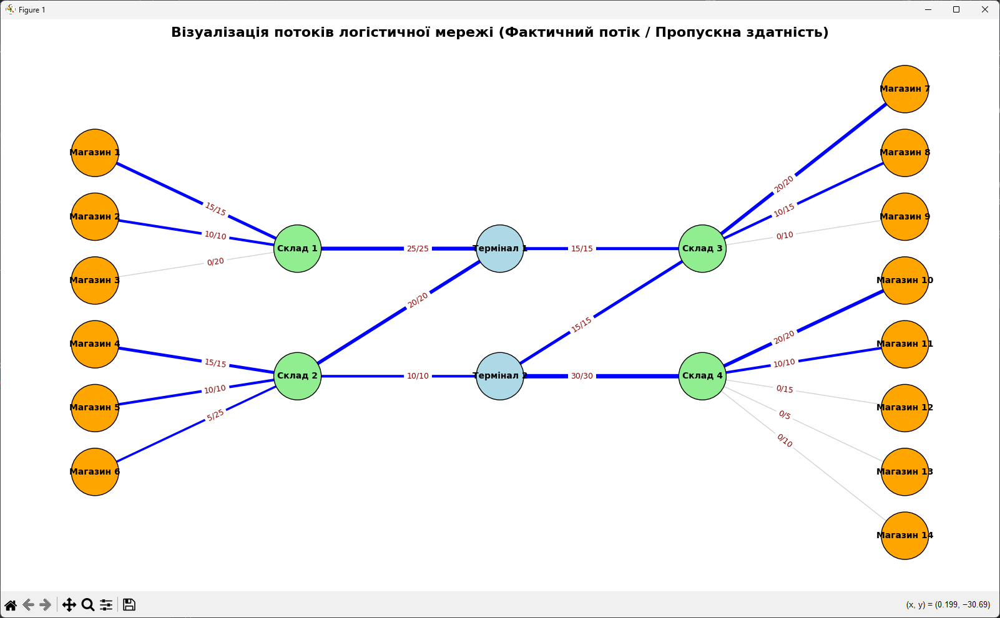
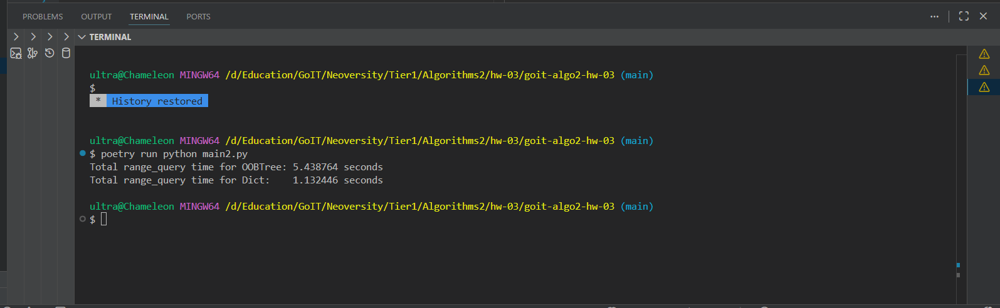

# ДЗ 3. Алгоритми на графах та дерева

## Інструкція запуску програми

1. **Встановлення залежностей:**
  Виконайте команду в кореневій папці проєкту:
   ```bash
   poetry install
   ```

2. **Запуск Завдання 1 (Мережеві потоки):**
   ```bash
   poetry run python main.py
   ```

3. **Запуск Завдання 2 (Порівняння OOBTree та dict):**
   ```bash
   poetry run python main2.py
   ```

## ЗВІТ

### Завдання 1: Максимальний потік у логістичній мережі (`main.py`):
 Написано програму для розподілення потоків і визначення, який термінал постачає товари в конкретний магазин (з урахуванням пропорцій на транзитних складах).

## Звіт завдання 1 (Алгоритм Едмондса-Карпа)

### Результати розрахунку потоків

| Термінал | Магазин | Фактичний Потік (одиниць) |
|----------|---------|---------------------------|
Термінал 1      | Магазин 1       | 15.00          
Термінал 1      | Магазин 2       | 10.00          
Термінал 1      | Магазин 3       | 0              
Термінал 1      | Магазин 4       | 10.00          
Термінал 1      | Магазин 5       | 6.67           
Термінал 1      | Магазин 6       | 3.33           
Термінал 1      | Магазин 7       | 10.00          
Термінал 1      | Магазин 8       | 5.00           
Термінал 1      | Магазин 9       | 0              
Термінал 1      | Магазин 10      | 0              
Термінал 1      | Магазин 11      | 0              
Термінал 1      | Магазин 12      | 0              
Термінал 1      | Магазин 13      | 0              
Термінал 1      | Магазин 14      | 0              
Термінал 2      | Магазин 1       | 0              
Термінал 2      | Магазин 2       | 0              
Термінал 2      | Магазин 3       | 0              
Термінал 2      | Магазин 4       | 5.00           
Термінал 2      | Магазин 5       | 3.33           
Термінал 2      | Магазин 6       | 1.67           
Термінал 2      | Магазин 7       | 10.00          
Термінал 2      | Магазин 8       | 5.00           
Термінал 2      | Магазин 9       | 0              
Термінал 2      | Магазин 10      | 20.00          
Термінал 2      | Магазин 11      | 10.00          
Термінал 2      | Магазин 12      | 0              
Термінал 2      | Магазин 13      | 0              
Термінал 2      | Магазин 14      | 0 

*Загальний максимальний потік  (від терміналів до магазинів): 115 одиниць.*



### Відповіді на запитання:
1. **Які термінали забезпечують найбільший потік товарів до магазинів?**
   - **Термінал 1** забезпечує потік у 60 одиниць, а **Термінал 2** — 55 одиниць. Термінал 1 має трохи більшу пропускну здатність і постачає більше товарів для магазинів.

2. **Які маршрути мають найменшу пропускну здатність і як це впливає на загальний потік?**
   - Найменшу пропускну здатність мають маршрути від складів до магазинів (наприклад, Склад 4 -> Магазин 13 з 5 одиницями). Але головним обмеженням для мережі є не вони, а **маршрути від Терміналів до Складів**. 

3. **Які магазини отримали найменше товарів і чи можна збільшити їх постачання, збільшивши пропускну здатність певних маршрутів?**
   - Магазини 3, 9, 12, 13, 14 взагалі не отримали товарів (потік 0). Щоб вони отримали товари, необхідно суттєво збільшити пропускну здатність маршрутів: **Термінал 1 -> Склад 1** та **Термінал 2 -> Склад 4**.

4. **Чи є вузькі місця, які можна усунути для покращення ефективності логістичної мережі?**
   - Так. Вузькі місця — це ребра, які максимально використали свою пропускну здатність:
     - **Термінал 1 -> Склад 1** (макс 25). Магазини 1, 2, 3 можуть прийняти 45 одиниць загалом, але через це вузьке місце вони недоотримують 20 одиниць.
     - **Термінал 2 -> Склад 4** (макс 30). Магазини 10, 11, 12, 13, 14 можуть прийняти 60 одиниць, але отримують лише 30.
   - Їхнє розширення миттєво підвищить ефективність усієї логістичної мережі.

---

### Завдання 2: Порівняння ефективності OOBTree та dict (`main2.py`)

---

## Звіт завдання 2 (порівняння OOBTree та dict)

Результати вимірювання часу (100 діапазонних запитів для 100 000 елементів):
- **Total range_query time for OOBTree:** 5.438764 seconds
- **Total range_query time for Dict:** 1.132446 seconds



**Висновок:** 
У цьому специфічному тесті стандартний словник `dict` працює швидше за `OOBTree`. Незважаючи на те, що `OOBTree` дозволяє робити пошук за діапазоном, не перебираючи всі ключі (асимптотична складність O(log N + K)), структура `dict` у Python реалізована мовою C і оптимізована для простих лінійних проходів. Через накладні витрати на об'єкти та обхід дерева в чистому Python, `OOBTree` виявився дещо повільнішим для такого обсягу даних. Однак, при значно більших масштабах даних або у випадку використання баз даних на диску, застосування B-дерев (`OOBTree`) буде виправданим і забезпечить кращу продуктивність.
